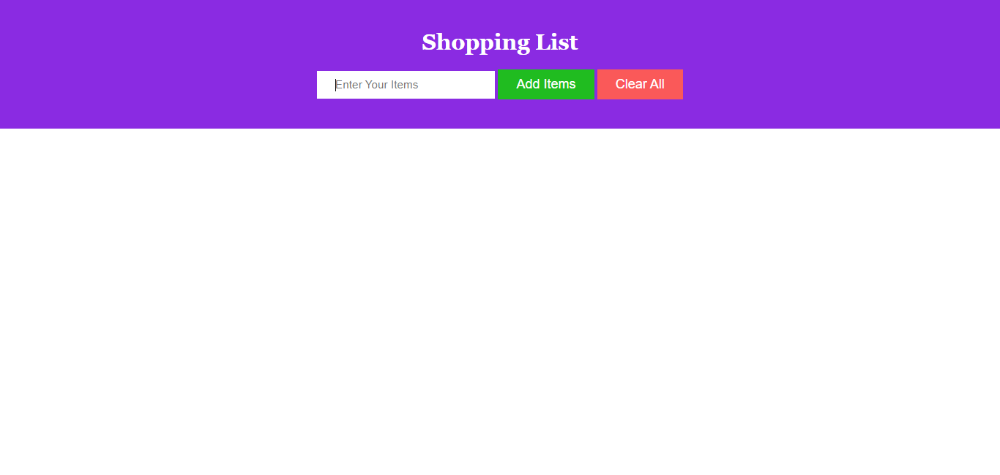

# Shopping List

## A very basic JavaScript DOM project

This is a very basic project on DOM. You can make a shopping list with the help of this project. Here, are some key features of this project:

1. Add a new item in your shopping list
2. Delete an item from the shopping list
3. Delete all the items from the shopping list

### Future Update

1. Edit the shopping list
2. Add a checkmark to the shopping list

### Project Demonstration

